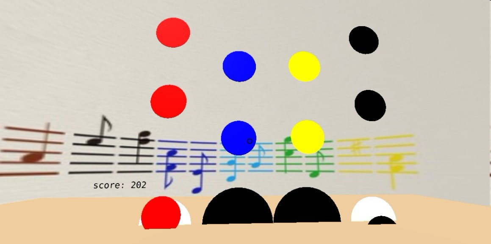

## VRsic

一款“音乐节奏类”游戏。制作粗糙，因为差不多要弃坑了，所以写一下README也还好看一点。。

利用[aframe](https://aframe.io)，实现VR部分。

基本和上个"游戏"的实现一样，想办法操作界面上的组件，就是了。没有什么难度，js也写的很烂。绝望～

### 玩法

P键——录制音乐节拍，zxcv四个键对应不同节拍，自行随意敲打

O键——停止。停止录制，或者停止游戏。

I键——开始游戏。录制节拍后，节拍从天而降，落到地面白圈内点击 hjkl 对应四个节拍，点击越准积分越高...

VR视角下，利用otg转接头，外接键盘玩耍..由于手机不合适，没有实际体验..

### 效果展示

